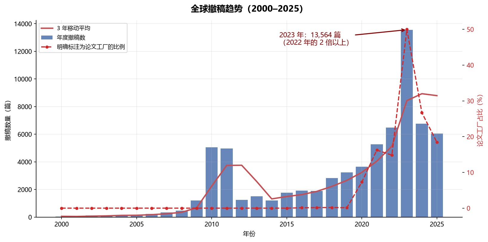
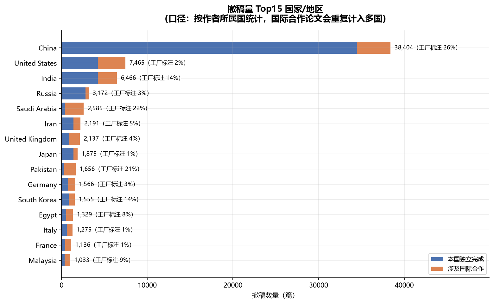
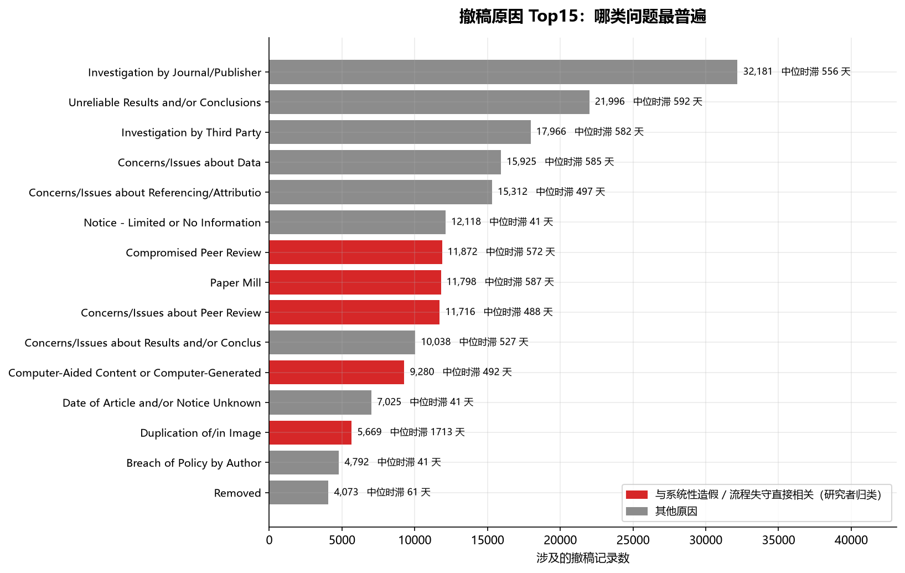
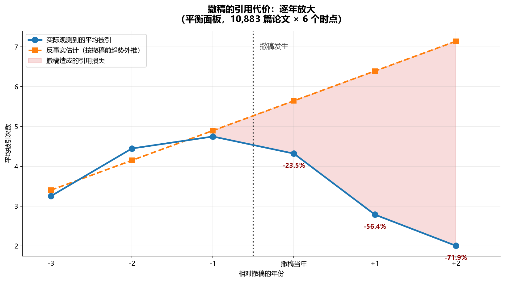
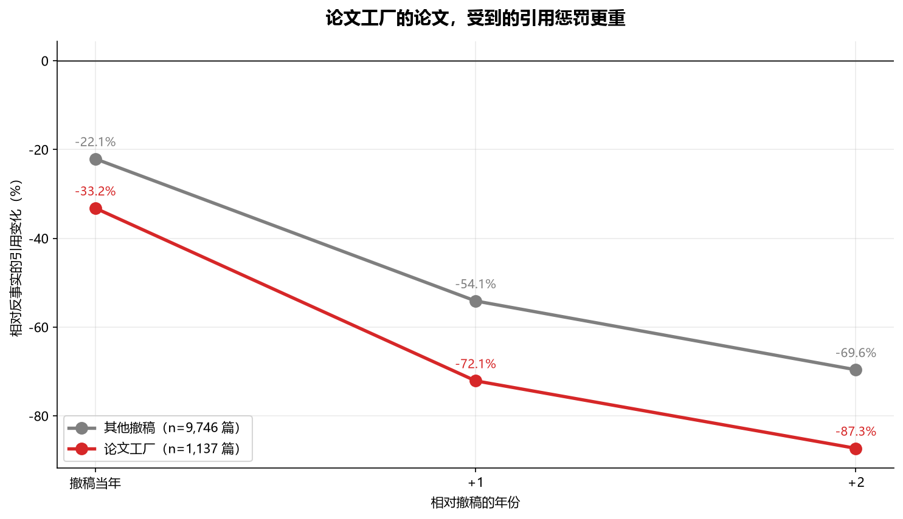
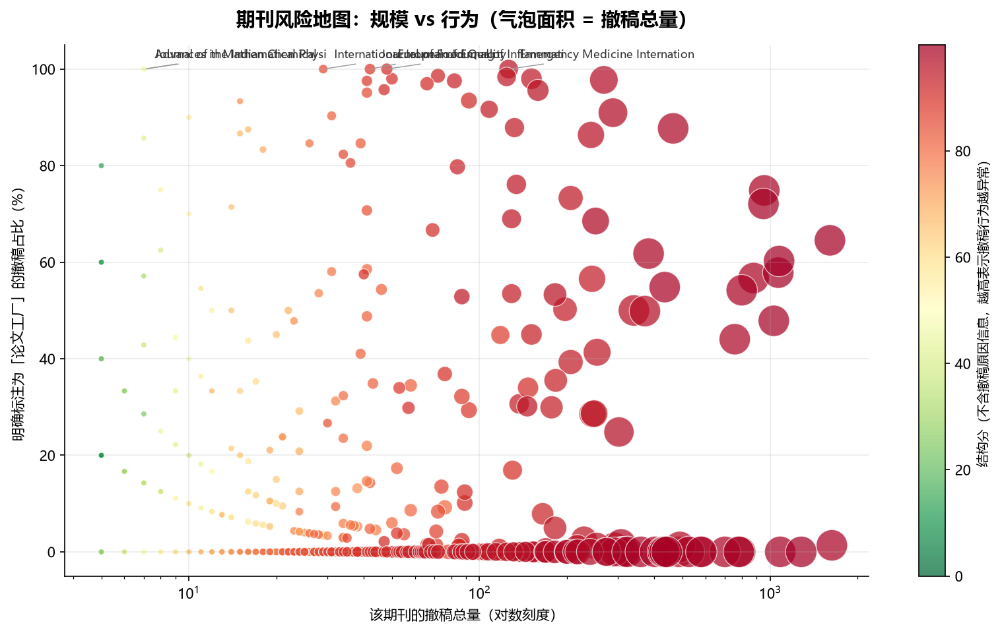
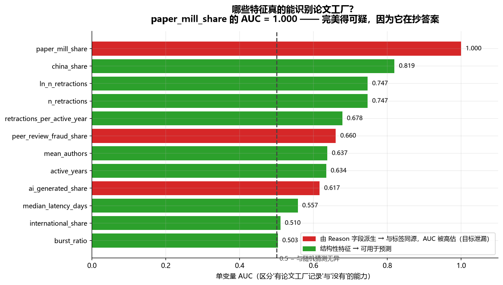
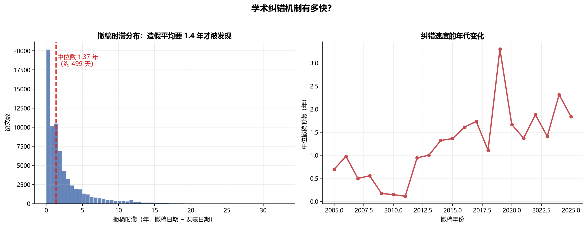
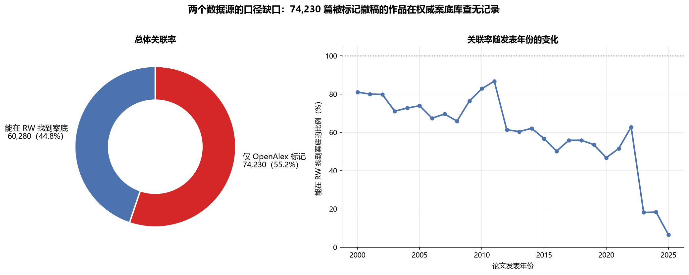
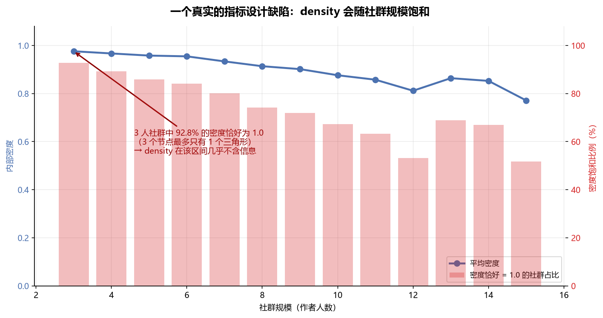

# PaperMill Hunter · 自动生成分析报告

> 生成时间：2026-09-18 16:14　|　全部数字由代码从数据仓库直接计算，无人工填写

---

## 数据规模

| 指标 | 数值 |
|---|---|
| Retraction Watch 撤稿记录 | 72,453 条 |
| 其中被标注为「论文工厂」 | 11,798 条 |
| OpenAlex 被撤稿作品 | 135,584 篇 |
| 其中带 DOI（可跨源关联） | 134,510 篇 |
| 跨源关联成功（DOI 匹配上 RW） | 60,280 篇（44.8%） |
| 合作网络边数 | 1,063,933 条 |
| 识别出的合作社群 | 11,089 个 |

---

## 一、撤稿趋势

*全球撤稿趋势（2000–2025）*

2023 年是绝对的高峰：一年 13,564 篇，超过 2022 年的两倍。
而 2010–2011 年的双峰对应两次会议论文集批量撤稿。

## 二、国家分布

*撤稿量 Top15 国家/地区*

中国以 52.9% 的占比位居第一。注意口径：按作者所属国统计，
国际合作论文会同时计入多个国家，因此各国之和远大于全球总数。

## 三、撤稿原因

*撤稿原因 Top15*

「Compromised Peer Review」（审稿流程被攻破）与「Paper Mill」
是最典型的两类系统性造假信号。

## 四、撤稿的引用代价（核心结论）

*事件研究：撤稿前后的引用轨迹*

采用**事件研究法**，以每篇论文自己的撤稿年份为原点，
用撤稿前 3 年的引用趋势线性外推反事实轨迹。

| 相对撤稿 | 样本量 | 相对反事实的引用变化 |
|---|---|---|
| -3 年 | 10,883 篇 | -4.4% |
| -2 年 | 10,883 篇 | +7.2% |
| -1 年 | 10,883 篇 | -3.0% |
| 撤稿当年 | 10,883 篇 | -23.5% |
| +1 年 | 10,883 篇 | -56.4% |
| +2 年 | 10,883 篇 | -71.9% |

**撤稿前窗口的最大偏差仅 7.2%**（说明反事实拟合合理），
**撤稿后最大跌幅达 -71.9%**。

### 分群对比：论文工厂的论文受罚更重

*论文工厂 vs 其他撤稿的引用代价*

| 群体 | 相对撤稿 | 引用变化 |
|---|---|---|
| 其他撤稿 | 撤稿当年 | -22.1% |
| 其他撤稿 | +1 年 | -54.1% |
| 其他撤稿 | +2 年 | -69.6% |
| 论文工厂 | 撤稿当年 | -33.2% |
| 论文工厂 | +1 年 | -72.1% |
| 论文工厂 | +2 年 | -87.3% |

## 五、期刊风险识别与模型验证

*期刊风险地图*

**两个分数，用途完全不同：**

| 分数 | AUC | 说明 |
|---|---|---|
| risk_score（严重度分，含标签特征 → 有泄漏） | 0.9779 | — |
| structural_score（结构分，无标签特征 → 可信） | 0.7363 | — |

*哪些特征真的能识别论文工厂*

`paper_mill_share` 的 AUC = 1.000，完美得可疑 —— 因为它与标签同源于
`Reason` 字段，这是**目标泄漏**。结构性特征（体量、强度）才是真实信号。

## 六、纠错机制有多快

*撤稿时滞分布与年代变化*

## 七、两个数据源的口径缺口

*OpenAlex 与 Retraction Watch 的关联缺口*

关联率仅 44.8% —— 74,230 篇被标记撤稿的作品在权威案底库中查无记录。

## 八、合作网络分析

基于 1,063,933 条合作关系、11,089 个合作社群的社群发现结果。

| 分数 | AUC | 说明 |
|---|---|---|
| 严重度分（含标签特征 → 有泄漏） | 0.8450 | — |
| 结构分（零标签特征 → 可信） | 0.3359 | — |

*density 指标的规模饱和问题*

**一个被记录在案的负结果**：结构分 AUC = 0.34，比随机还差。
查证后发现结构分最高的是教科书、会议论文集等大规模撤稿，而非论文工厂；
同时 `density` 在小社群上饱和（3 人社群 92.8% 密度为 1.0），几乎不含信息。
详细分析见 `analysis/network.py` 的注释。

---

## 数据质量

- 校验规则总数：**38**
- 通过：**36**
- 阻断级失败：**0**
- 警告：**2**

> 本报告由 `scripts/06_generate_report.py` 自动生成。
> 所有图表与数字均可在本地用 README 中的命令一键复现。
